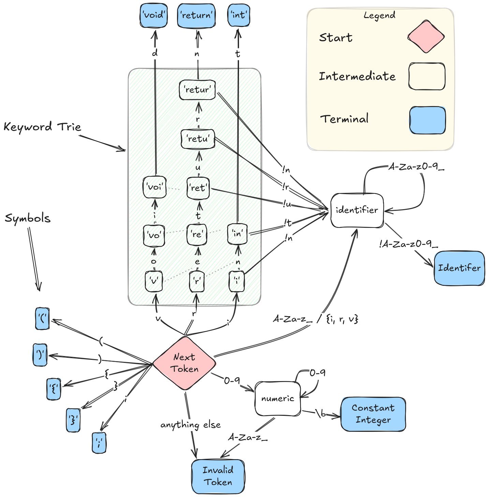

# TBCC Lexer

The lexer for the tbcc C compiler is based on a finite state machine abstraction. This is about halfway to the way that the fastest lexers in the business are written using jump table based state machines. I have chosen to take the easier road of implementing my state machine with switch statements and conditionionals, because I don't really care that much about performance and prefer to preserve my sanity.

## Chapter 1

The Chapter 1 lexer is pretty simple. It can parse a smattering of basic, single-character symbols, integers, identfiers, and three keywords: `void`, `return` and `int`. The keywords are parsed using a trie data structure. The choice of a trie, and by extensions the rest of the lexer, comes from one basic idea: that ever token should be read exactly once and backtracking should be avoided at all costs. 